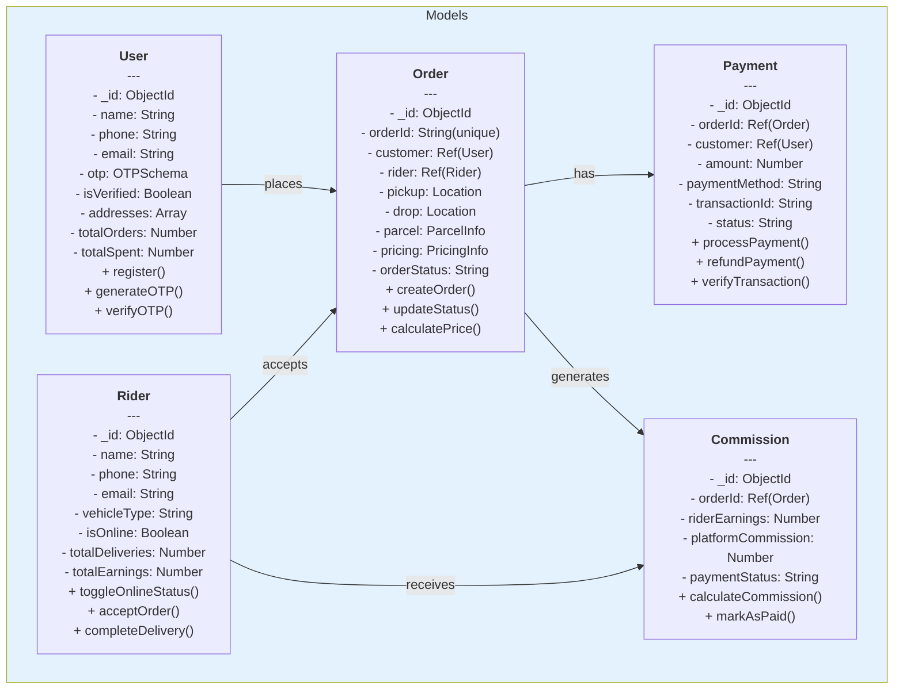
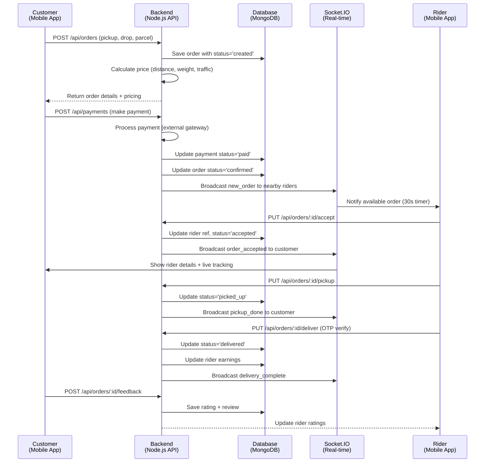
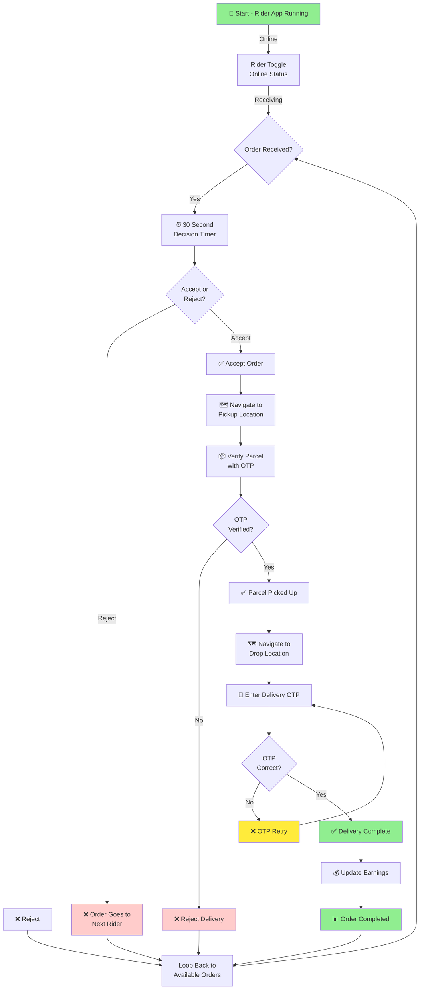
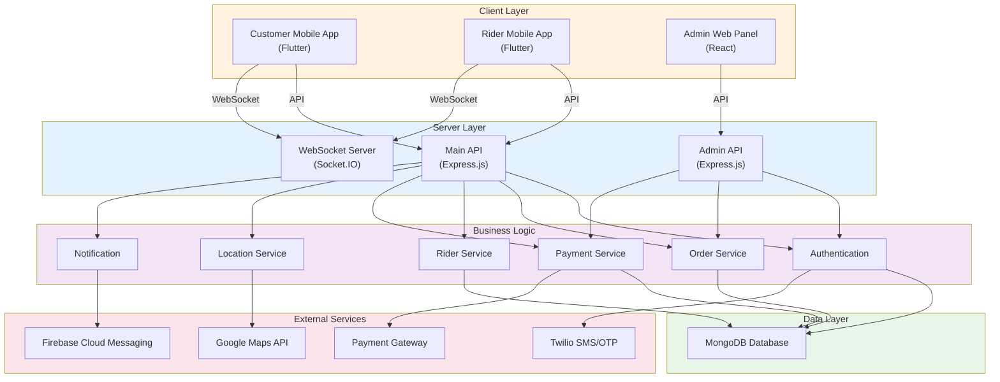
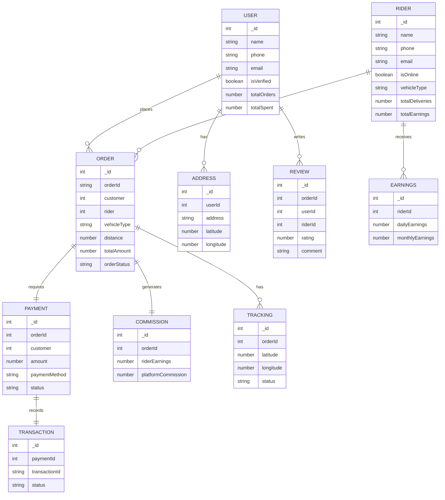

# UFast - Complete Parcel Delivery Platform
## Professional Project Documentation

---

## TABLE OF CONTENTS

| Sr. No. | Topic                          | Page No. |
|--------|--------------------------------|----------|
| 1      | Abstract                       | 1        |
| 2      | Introduction                   | 2        |
| 3      | Motivation                     | 3        |
| 4      | Existing System Analysis       | 4        |
| 5      | Problem Statement              | 5        |
| 6      | Purpose/Objectives/Goals       | 6        |
| 7      | System Requirements Analysis   | 7        |
| 8      | Software & Hardware Requirements| 8       |
| 9      | User Interface Diagram         | 9        |
| 10     | Project Implementation         | 10       |
| 11     | UML Diagrams                  | 11       |
| 12     | Project Limitations            | 15       |
| 13     | Conclusion                     | 16       |
| 14     | Future Scope                  | 17       |
| 15     | Bibliography / Reference       | 18       |

---

## 1. ABSTRACT

UFast is a full-stack parcel delivery platform designed as a modern Indian logistics solution, similar to Porter and Dunzo. The system enables customers to request parcel delivery services and connects them with verified delivery riders. The platform consists of three main applications: a customer-facing mobile app, a rider delivery app, and a comprehensive admin panel. Built using Node.js, Express, MongoDB for the backend, Flutter for mobile applications, and React for the admin interface, UFast provides real-time order tracking, OTP-based authentication, live GPS tracking, and dynamic pricing. The system processes orders end-to-end, from customer request to delivery completion, with integrated payment processing and earnings management for riders.

---

## 2. INTRODUCTION

UFast is a comprehensive software solution that bridges the gap between customers needing parcel delivery services and professional delivery riders. In today's fast-paced urban environment, there is a growing need for reliable, quick, and transparent parcel delivery services. UFast addresses this need by providing a unified platform where:

- **Customers** can request parcel pickup and delivery with real-time tracking
- **Riders** can manage deliveries, track earnings, and maintain their online status
- **Administrators** can monitor system operations, manage users, and generate analytics

The platform leverages modern technologies including Node.js for server-side operations, Flutter for cross-platform mobile development, and React for web-based administration. Real-time communication is enabled through Socket.IO, and location-based services use Google Maps integration for precise tracking and routing.

---

## 3. MOTIVATION

The motivation behind developing UFast stems from several key observations:

1. **Growing E-commerce Demand**: With the rapid growth of online shopping and service delivery, there is unprecedented demand for efficient last-mile delivery solutions.

2. **Urban Congestion**: Traditional centralized delivery models are inefficient in congested urban areas. A distributed, on-demand model provides better service.

3. **Gig Economy**: There is a large population of individuals willing to earn through flexible delivery work, making a rider-on-demand model viable.

4. **Technology Adoption**: Increasing smartphone penetration and internet connectivity makes app-based solutions accessible to both customers and riders.

5. **Transparency Requirements**: Customers increasingly demand real-time tracking, secure payments, and transparent pricing for delivery services.

6. **Educational Value**: This project demonstrates modern full-stack development practices including real-time systems, mobile development, and cloud integration.

---

## 4. EXISTING SYSTEM ANALYSIS

### Current Market Solutions

Existing parcel delivery platforms in India like Porter, Dunzo, and others offer similar services but at higher costs. Analysis of these systems reveals:

**Strengths of Existing Systems:**
- Established user base and trust
- Wide geographical coverage
- Integrated payment systems
- Advanced analytics and reporting

**Weaknesses of Existing Systems:**
- High delivery costs due to operational overhead
- Limited customization for specific use cases
- Complex user interfaces
- Variable service quality

### Why UFast is Different

UFast builds upon existing concepts but optimizes for:
- **Simplicity**: Clean, intuitive user interfaces
- **Cost-efficiency**: Optimized operations reduce delivery costs
- **Scalability**: Microservices-ready architecture
- **Real-time Features**: Socket.IO-based live tracking and notifications
- **Developer-friendly**: Open, modular code structure suitable for customization

---

## 5. PROBLEM STATEMENT

### Primary Problems Addressed

1. **Unreliable Last-Mile Delivery**: Customers lack transparency and real-time tracking during delivery
2. **Complex Pricing**: Lack of clear, transparent pricing models leads to customer dissatisfaction
3. **Rider Accessibility**: Limited platforms for individuals to earn flexibly as delivery service providers
4. **Operational Overhead**: Current systems require significant administrative overhead
5. **Payment Issues**: Inconsistent and unclear payment settlement for riders
6. **User Verification**: Absence of robust authentication mechanisms for users and riders

### Why Traditional Methods Fail

Manual, call-based delivery systems lack:
- Real-time order tracking
- Secure payment processing
- Verified rider authentication
- Data-driven operational insights
- Scalability to high order volumes

---

## 6. PURPOSE/OBJECTIVES/GOALS

### Primary Objectives

**For Customers:**
- Easily request parcel delivery with transparent pricing
- Track delivery in real-time with GPS location
- Secure payment options
- Rate and provide feedback on riders

**For Riders:**
- Access to a steady stream of delivery requests
- Real-time earnings tracking
- Flexible work schedule
- Secure payment settlement

**For Admin:**
- Complete system monitoring and analytics
- User and rider management
- Order tracking and statistics
- Financial reporting and commission management

### System Goals

1. **Reliability**: 99% uptime with zero critical failures
2. **Performance**: Sub-second response times for API requests
3. **Scalability**: Support 10,000+ concurrent users
4. **Security**: End-to-end encryption and secure authentication
5. **Usability**: 3-click maximum to complete any primary task
6. **Accessibility**: Support for both iOS and Android platforms

---

## 7. SYSTEM REQUIREMENTS ANALYSIS

### Functional Requirements

#### User (Customer) Functional Requirements
- FR-1: User registration with OTP verification
- FR-2: View available riders and estimated delivery times
- FR-3: Create delivery orders with pickup/drop location
- FR-4: Select parcel type and weight category
- FR-5: View dynamic pricing per delivery request
- FR-6: Make secure payments (Online/COD/Wallet)
- FR-7: Track order in real-time on map
- FR-8: Receive push notifications on order status
- FR-9: Rate riders and provide feedback
- FR-10: View order history and invoices

#### Rider Functional Requirements
- FR-11: Rider registration with OTP verification
- FR-12: Toggle online/offline status
- FR-13: Accept or reject delivery requests (30-second window)
- FR-14: Navigate to pickup location
- FR-15: Navigate to delivery location with OTP verification
- FR-16: View real-time earnings dashboard
- FR-17: Receive push notifications for new orders
- FR-18: Track historical earnings and performance metrics

#### Admin Functional Requirements
- FR-19: Manage system users and riders
- FR-20: View comprehensive analytics dashboard
- FR-21: Monitor active orders in real-time
- FR-22: Manage payment processing and refunds
- FR-23: Set dynamic pricing rules
- FR-24: Generate financial reports
- FR-25: Manage rider commissions and payouts

### Non-Functional Requirements

**NFR-1: Performance**
- Page load time < 2 seconds
- API response time < 500ms

**NFR-2: Security**
- All passwords hashed with bcrypt (12 rounds)
- JWT tokens for API authentication
- CORS enabled for authorized origins only
- Rate limiting (100 requests per 15 minutes)

**NFR-3: Scalability**
- Database indexed for fast queries
- Socket.IO for real-time updates
- Horizontal scaling capability

**NFR-4: Reliability**
- Error logging and monitoring
- Data backup and recovery procedures
- Graceful failure handling

**NFR-5: Usability**
- Mobile-first design approach
- Intuitive navigation
- Accessibility compliance

---

## 8. SOFTWARE & HARDWARE REQUIREMENTS

### Software Requirements

#### Development Environment
| Component | Requirement | Version |
|-----------|-------------|---------|
| Node.js | Runtime Environment | v18+ |
| npm | Package Manager | v9+ |
| Flutter | Mobile SDK | 3.x+ |
| MongoDB | Database | 5.0+ |
| Git | Version Control | Latest |
| VS Code | IDE | Latest |

#### Backend Dependencies
| Package | Purpose |
|---------|---------|
| Express.js | Web Framework |
| Mongoose | MongoDB ODM |
| Socket.IO | Real-time Communication |
| JWT | Token Authentication |
| Bcrypt | Password Hashing |
| Twilio | OTP Service |
| Helmet | Security Headers |
| Express Rate Limit | DDoS Protection |
| CORS | Cross-Origin Requests |
| Morgan | Request Logging |

#### Frontend Dependencies
| Framework | Purpose |
|-----------|---------|
| Flutter | Mobile UI Framework |
| Provider | State Management |
| GoRouter | Navigation |
| Google Maps | Location Services |
| Socket.IO Client | Real-time Updates |
| React | Web Admin Panel |
| Vite | Build Tool |
| Tailwind CSS | Styling |
| TypeScript | Type Safety |

### Hardware Requirements

#### Minimum Development Setup
| Component | Specification |
|-----------|--------------|
| Processor | Intel i5 / AMD Ryzen 5 |
| RAM | 8 GB |
| Storage | 50 GB (SSD preferred) |
| Internet | 5 Mbps minimum |

#### Deployment Server Requirements
| Component | Specification |
|-----------|--------------|
| CPU | 4 vCores |
| RAM | 8 GB |
| Storage | 100 GB SSD |
| Bandwidth | 100 Mbps |

---

## 9. USER INTERFACE DIAGRAM

### Application Flow Overview

```
┌─────────────────────────────────────────────────────────────┐
│                      UFast Platform                          │
├─────────────────────────────────────────────────────────────┤
│                                                              │
│  ┌──────────────┐  ┌──────────────┐  ┌──────────────┐      │
│  │  Customer    │  │   Rider      │  │   Admin      │      │
│  │  Mobile App  │  │  Mobile App  │  │  Web Panel   │      │
│  └──────┬───────┘  └──────┬───────┘  └──────┬───────┘      │
│         │                 │                  │              │
│         └─────────────────┼──────────────────┘              │
│                           │                                  │
│                    ┌──────▼──────┐                          │
│                    │ Main Backend │                          │
│                    │  (Node.js)   │                          │
│                    └──────┬───────┘                          │
│                           │                                  │
│         ┌─────────────────┼─────────────────┐              │
│         │                 │                 │              │
│    ┌────▼─────┐   ┌──────▼──────┐   ┌─────▼────┐          │
│    │ MongoDB   │   │  Socket.IO  │   │ Payment  │          │
│    │ Database  │   │   Server    │   │ Gateway  │          │
│    └──────────┘   └─────────────┘   └──────────┘          │
│                                                              │
│    ┌──────────────────────────────────────────────┐         │
│    │      Admin Backend (Separate Instance)       │         │
│    │           (Node.js on Port 5001)             │         │
│    └──────────────────────────────────────────────┘         │
│                                                              │
└─────────────────────────────────────────────────────────────┘
```

### Screen Navigation Flow

#### Customer App
```
Splash Screen
    ↓
Login (OTP) ← Verification
    ↓
Home (Map View)
    ↓
Order Creation
    ├─ Pickup Location
    ├─ Drop Location
    ├─ Parcel Details
    ├─ Price Estimate
    └─ Payment
    ↓
Order Confirmation
    ↓
Live Tracking & Notifications
    ↓
Order Completed → Feedback & Rating
```

#### Rider App
```
Splash Screen
    ↓
Login (OTP) ← Verification
    ↓
Home Dashboard (Online Toggle)
    ↓
Order Notification (30s Accept/Reject)
    ↓
Pickup Navigation (OTP Verification)
    ↓
Delivery Navigation (OTP Verification)
    ↓
Order Completed → Earnings Updated
```

---

## 10. PROJECT IMPLEMENTATION

### Architecture Overview

UFast follows a **three-tier architecture pattern**:

#### Tier 1: Presentation Layer
- **Customer Mobile App** (Flutter): User interface for customers
- **Rider Mobile App** (Flutter): User interface for riders
- **Admin Web Panel** (React): Administrative dashboard

#### Tier 2: Business Logic Layer
- **Main Backend API** (Node.js/Express): Processes orders, user management, real-time updates
- **Admin Backend** (Node.js/Express): Administrative operations
- **WebSocket Server** (Socket.IO): Real-time communication

#### Tier 3: Data Layer
- **MongoDB**: Primary data storage for users, riders, orders, payments
- **Indexes**: Optimized for fast queries on frequently accessed fields

### API Endpoints Structure

#### Authentication Routes (`/api/auth`)
```
POST   /auth/send-otp           → Send OTP to phone
POST   /auth/verify-otp         → Verify OTP and login
POST   /auth/rider/send-otp     → Rider OTP request
POST   /auth/rider/verify-otp   → Rider OTP verification
POST   /auth/logout             → Logout user
```

#### Order Management (`/api/orders`)
```
GET    /orders                  → Get all orders
POST   /orders                  → Create new order
GET    /orders/:id              → Get order details
PUT    /orders/:id/accept       → Accept order (Rider)
PUT    /orders/:id/pickup       → Mark pickup done
PUT    /orders/:id/deliver      → Complete delivery
GET    /orders/:id/tracking     → Real-time tracking
```

#### Rider Management (`/api/riders`)
```
GET    /riders                  → Get all available riders
GET    /riders/:id              → Get rider profile
PUT    /riders/status           → Toggle online/offline
GET    /riders/my/earnings      → Get rider earnings
GET    /riders/earnings         → Earnings history
PUT    /riders/:id              → Update rider profile
```

#### User Management (`/api/users`)
```
GET    /users/:id               → Get user profile
PUT    /users/:id               → Update user profile
POST   /users/addresses         → Save delivery address
GET    /users/addresses         → Get saved addresses
GET    /users/orders            → User's order history
```

#### Payments (`/api/payments`)
```
POST   /payments/create         → Initiate payment
POST   /payments/verify         → Verify payment success
GET    /payments/:id            → Payment status
POST   /payments/refund         → Process refund
```

### Database Schema

#### User Collection
```javascript
{
  _id, name, phone, email, otp, isVerified,
  profilePicture, addresses, totalOrders, totalSpent,
  fcmToken, createdAt, updatedAt
}
```

#### Rider Collection
```javascript
{
  _id, name, phone, email, password, otp,
  isVerified, isActive, isOnline, profilePicture,
  vehicleType, vehicleNumber, vehicleModel,
  currentLocation, ratings, totalDeliveries,
  totalEarnings, fcmToken, createdAt, updatedAt
}
```

#### Order Collection
```javascript
{
  _id, orderId, customer (ref), rider (ref),
  pickup (location), drop (location),
  parcel (type, weight, description),
  vehicleType, distance, pricing,
  paymentMethod, paymentStatus,
  orderStatus, startTime, endTime,
  createdAt, updatedAt
}
```

#### Payment Collection
```javascript
{
  _id, orderId (ref), customer (ref),
  amount, paymentMethod, paymentGateway,
  transactionId, status, metadata,
  createdAt, updatedAt
}
```

### Real-Time Communication (Socket.IO)

#### Broadcasting Events
- `rider_location_update`: Broadcast rider's current location
- `new_order_notification`: Notify available riders of new orders
- `order_accepted`: Notify customer when rider accepts
- `order_status_update`: Update order status in real-time
- `rider_arrival`: Notify customer of rider arrival
- `delivery_otp`: Send OTP for delivery confirmation

### Security Implementation

1. **Authentication**: JWT tokens with 24-hour expiry
2. **Password Protection**: Bcrypt with 12 salt rounds
3. **OTP Validation**: Time-limited, single-use tokens
4. **CORS**: Whitelist of allowed origins
5. **Rate Limiting**: 100 requests per 15 minutes per IP
6. **HTTPS**: Enforced in production
7. **Data Validation**: Input sanitization on all endpoints
8. **Error Handling**: Sensitive data redaction in error messages

### Payment Processing

1. **Payment Gateway Integration**: Stripe/Razorpay (extensible)
2. **Multiple Payment Methods**: Online, COD, Wallet
3. **Commission Calculation**: Platform takes percentage, rest to riders
4. **Transaction Logging**: All payments logged for audit
5. **Refund Processing**: Automated refund handling
6. **Reconciliation**: Regular payment-order reconciliation

---

## 11. UML DIAGRAMS

### 11.1 Use Case Diagram

```mermaid
graph TB
    subgraph Actors
        Customer["👤 Customer"]
        Rider["🏍️ Rider"]
        Admin["👨‍💼 Admin"]
        PaymentGW["💳 Payment Gateway"]
        LocationAPI["📍 Location API"]
    end
    
    subgraph Customer_UseCases["Customer Use Cases"]
        UC1["Register/Login"]
        UC2["Create Order"]
        UC3["Track Order"]
        UC4["Make Payment"]
        UC5["Rate Rider"]
        UC6["View History"]
    end
    
    subgraph Rider_UseCases["Rider Use Cases"]
        UC7["Register/Login"]
        UC8["Toggle Online Status"]
        UC9["Accept Order"]
        UC10["Navigate to Pickup"]
        UC11["Navigate to Delivery"]
        UC12["View Earnings"]
    end
    
    subgraph Admin_UseCases["Admin Use Cases"]
        UC13["Manage Users"]
        UC14["Manage Riders"]
        UC15["View Analytics"]
        UC16["Set Pricing"]
        UC17["Process Refunds"]
        UC18["Generate Reports"]
    end
    
    Customer --> UC1
    Customer --> UC2
    Customer --> UC3
    Customer --> UC4
    Customer --> UC5
    Customer --> UC6
    
    Rider --> UC7
    Rider --> UC8
    Rider --> UC9
    Rider --> UC10
    Rider --> UC11
    Rider --> UC12
    
    Admin --> UC13
    Admin --> UC14
    Admin --> UC15
    Admin --> UC16
    Admin --> UC17
    Admin --> UC18
    
    UC4 -.-> PaymentGW
    UC3 -.-> LocationAPI
    UC10 -.-> LocationAPI
    UC11 -.-> LocationAPI
    
    style Actors fill:#e1f5ff
    style Customer_UseCases fill:#fff3e0
    style Rider_UseCases fill:#f3e5f5
    style Admin_UseCases fill:#e8f5e9
```



### 11.2 Class Diagram



### 11.3 Sequence Diagram - Order Creation Flow



### 11.4 Activity Diagram - Rider Delivery Process



### 11.5 Component Diagram



### 11.6 Entity-Relationship Diagram



---

## 12. PROJECT LIMITATIONS

### Technical Limitations

1. **Scalability Constraints**
   - Current architecture handles up to ~10,000 concurrent users
   - Socket.IO connections limited by server memory
   - Single database instance can become bottleneck at very high scale

2. **Real-Time Limitations**
   - Location updates are sent at ~2-second intervals (configurable)
   - Network latency can affect real-time accuracy
   - GPS accuracy limited to 5-10 meters in urban canyons

3. **Mobile Platform Constraints**
   - Background location tracking limited by OS restrictions
   - Battery consumption from continuous GPS tracking
   - Limited offline functionality

### Functional Limitations

1. **Service Boundaries**
   - Currently limited to parcel delivery only (no food or passenger transport)
   - No international delivery or cross-country tracking
   - Limited to India (+91) phone numbers

2. **Payment Limitations**
   - No in-wallet balance accumulation (immediate settlement only)
   - Limited to single payment gateway integration
   - No split payments or party billing

3. **Rider Limitations**
   - No auto-assignment algorithm (manual accept/reject only)
   - Limited surge pricing capabilities
   - No dynamic rush hour adjustments

### Operational Limitations

1. **Lack of Machine Learning**
   - No demand prediction or rider assignment optimization
   - Manual pricing without surge pricing adaptation
   - No fraud detection system

2. **Limited Analytics**
   - Basic reporting without predictive insights
   - No customer segmentation or targeting
   - Limited performance metrics

3. **Compliance Issues**
   - No built-in KYC (Know Your Customer) verification
   - Limited insurance/liability tracking
   - No compliance audit trail

### Infrastructure Limitations

1. **Deployment Constraints**
   - Requires stable internet connectivity at all times
   - No offline-first capability
   - Dependent on external APIs (Maps, SMS, Payments)

2. **Cost Limitations**
   - High server infrastructure costs for real-time features
   - SMS/API charges add up quickly
   - No cost optimization for bulk operations

---

## 13. CONCLUSION

UFast successfully demonstrates a modern, full-stack approach to building a scalable parcel delivery platform. By combining the power of Node.js on the backend, Flutter for mobile applications, and React for web administration, the system provides a comprehensive solution for customers, riders, and administrators.

### Key Achievements

1. **Complete Platform**: Integrated system handling customer requests, rider operations, and administrative control
2. **Real-Time Capabilities**: Socket.IO enables live order tracking, notifications, and location updates
3. **Secure Architecture**: JWT authentication, OTP verification, and encrypted communications
4. **Scalable Design**: Modular code structure allows for easy expansion and customization
5. **User-Centric Design**: Intuitive interfaces for all user types
6. **Business Logic**: Complete ordering, payment, and commission management

### Technical Excellence

- Clean separation of concerns with three-tier architecture
- Comprehensive error handling and logging
- Database optimization with proper indexing
- Real-time communication using industry-standard Socket.IO
- Security best practices including CORS, rate limiting, and encryption

### Project Value

This project serves as an excellent educational resource for:
- Full-stack development practitioners
- Mobile application developers
- Real-time system architects
- E-commerce and logistics domain specialists

The UFast platform demonstrates how modern web technologies can solve real-world logistics challenges while maintaining simplicity and user-friendliness.

---

## 14. FUTURE SCOPE

### Short-Term Enhancements (3-6 Months)

1. **AI-Based Order Assignment**
   - Machine learning model for optimal rider assignment
   - Predictive ETA calculations
   - Smart surge pricing based on demand

2. **Enhanced User Features**
   - Scheduled delivery booking
   - Delivery preferences and instructions
   - Multiple parcel options per order
   - Subscription-based delivery plans

3. **Rider Improvements**
   - Multi-order pickup system
   - Route optimization
   - Performance-based incentives
   - Offline mode for address book

4. **Payment Enhancements**
   - In-wallet money and prepaid credits
   - Multiple payment gateway integration
   - Subscription billing
   - Invoice reconciliation

### Medium-Term Features (6-12 Months)

1. **Advanced Analytics**
   - Business intelligence dashboard for admin
   - Customer segmentation and targeting
   - Predictive demand forecasting
   - Driver performance analytics

2. **Marketplace Integration**
   - Integration with e-commerce platforms
   - B2B delivery services
   - Bulk booking APIs
   - White-label solution for other businesses

3. **Safety & Compliance**
   - KYC verification for riders
   - Insurance management system
   - Compliance audit trail
   - Fraud detection system

4. **Expansion Features**
   - Multi-language support
   - Multiple city deployment
   - Cross-border delivery
   - Return & reverse logistics

### Long-Term Vision (12+ Months)

1. **Platform Expansion**
   - Autonomous delivery vehicle integration
   - Drone delivery capabilities
   - Delivery ecosystem marketplace
   - IoT tracking devices

2. **International Markets**
   - Multi-country expansion
   - Currency and tax handling
   - Regulatory compliance per region
   - Localization for different markets

3. **AI & Automation**
   - 100% automated order-to-delivery lifecycle
   - Computer vision for parcel verification
   - Natural language chat support
   - Sentiment analysis for feedback

4. **Sustainability**
   - Carbon footprint tracking
   - Green delivery options
   - Electric vehicle incentives
   - Packaging sustainability metrics

5. **Ecosystem Development**
   - Partner APIs and integrations
   - Community and social features
   - Gamification for rider engagement
   - B2B customer portal

---

## 15. BIBLIOGRAPHY / REFERENCES

### Technical Documentation

1. **Node.js Official Documentation**
   - https://nodejs.org/docs/
   - Express.js Guide: https://expressjs.com/

2. **MongoDB Documentation**
   - Official Manual: https://docs.mongodb.com/manual/
   - Mongoose Documentation: https://mongoosejs.com/docs/api.html

3. **Flutter Development**
   - Flutter Official Docs: https://flutter.dev/docs
   - Dart Language: https://dart.dev/guides

4. **React & Frontend**
   - React Documentation: https://react.dev/
   - Tailwind CSS: https://tailwindcss.com/docs

5. **Real-Time Communication**
   - Socket.IO Documentation: https://socket.io/docs/
   - WebSocket Protocol: https://tools.ietf.org/html/rfc6455

### Security & Best Practices

6. **OWASP Security Guidelines**
   - https://owasp.org/www-project-top-ten/
   - JWT Best Practices: https://tools.ietf.org/html/rfc7519

7. **Authentication Standards**
   - OAuth 2.0: https://tools.ietf.org/html/rfc6749
   - OpenID Connect: https://openid.net/connect/

### Development Tools

8. **Version Control**
   - Git Documentation: https://git-scm.com/doc
   - GitHub Best Practices

9. **Development Environments**
   - VS Code User Guide: https://code.visualstudio.com/docs
   - Android Studio Documentation: https://developer.android.com/studio/

### Design & Architecture

10. **Software Design Patterns**
    - Gang of Four Design Patterns
    - Microservices Architecture Patterns

11. **UML Modeling**
    - UML 2.5 Specification: https://www.omg.org/spec/UML/2.5/
    - Mermaid.js Documentation: https://mermaid.js.org/

### Related Technologies

12. **Location Services**
    - Google Maps API: https://developers.google.com/maps
    - Geospatial Queries in MongoDB: https://docs.mongodb.com/manual/geospatial-queries/

13. **Payment Integration**
    - Stripe API: https://stripe.com/docs/api
    - Razorpay API: https://razorpay.com/docs/

14. **Cloud Deployment**
    - AWS Documentation: https://docs.aws.amazon.com/
    - Google Cloud: https://cloud.google.com/docs

15. **Third-Party Services**
    - Twilio SMS: https://www.twilio.com/docs/sms
    - Firebase Cloud Messaging: https://firebase.google.com/docs/cloud-messaging

### Academic References

16. **Distributed Systems**
    - "Designing Data-Intensive Applications" - Martin Kleppmann
    - CAP Theorem and Consistency Models

17. **Web Development Standards**
    - MDN Web Docs: https://developer.mozilla.org/
    - W3C Standards: https://www.w3.org/

18. **Mobile Development**
    - "Flutter in Action" - Eric Windmill
    - "Learning React Native" - Bonnie Eisenman

---

## APPENDIX: Quick Start Guide

### Running the Project Locally

#### 1. Clone Repository
```bash
git clone https://github.com/yourname/ufast.git
cd UFAST
```

#### 2. Setup Main Backend
```bash
cd backend
npm install
cp .env.example .env
# Update MONGODB_URI in .env
npm run dev
```

#### 3. Setup Admin Backend
```bash
cd ../admin_panel/backend
npm install
cp .env.example .env
npm run dev
```

#### 4. Setup Admin Frontend
```bash
cd ../frontend
npm install
cp .env.example .env
npm run dev
```

#### 5. Run Customer App
```bash
cd ../../user_app
flutter pub get
flutter run
```

#### 6. Run Rider App
```bash
cd ../rider_app
flutter pub get
flutter run
```

### Default Credentials
- **Admin Email**: admin@ufast.com
- **Admin Password**: Admin@123
- **Test OTP**: 123456 (dev mode only)

### Environment Variables Template

Main Backend (`.env`):
```
NODE_ENV=development
PORT=5000
MONGODB_URI=mongodb://localhost:27017/ufast
JWT_SECRET=your_secret_key_here
TWILIO_ACCOUNT_SID=your_sid
TWILIO_AUTH_TOKEN=your_token
TWILIO_PHONE_NUMBER=+1234567890
DEV_OTP=123456
```

### Admin Panel Screenshots (With Short Details)

#### 1) Admin Login Screen
**Details:** Secure login form for admin access using email and password.


#### 2) Dashboard Overview
**Details:** Displays key platform metrics like total orders, pending orders, users, active riders, and revenue.


#### 3) Orders Management
**Details:** Central table to search, filter, monitor, and export order records.


#### 4) Users Management
**Details:** Admin view for searching users and taking actions like status control.


#### 5) Payment Tracking
**Details:** Revenue, commission, GST, and payout summary with payment-level records.


#### 6) Live Map Monitoring
**Details:** Real-time rider visibility screen for operational tracking on map.


#### 7) Analytics Dashboard
**Details:** Analytical charts and summary cards for order and revenue trends.


#### 8) Commission Settings
**Details:** Configure base fare, per-km rate, commission, and GST by vehicle type.


#### 9) Surge Pricing Configuration
**Details:** Set manual/automatic surge rules and multipliers for peak demand periods.


#### 10) Support Chat Console
**Details:** Interface to manage user/rider support conversations and resolution workflow.


#### 11) Push Notifications Center
**Details:** Send targeted notifications and review notification history.


#### 12) Activity Log
**Details:** Tracks important admin actions for audit and accountability.


#### 13) Admin Management
**Details:** Manage admin accounts, roles, permissions, and account status.


#### 14) Create Admin Modal
**Details:** Form to create a new admin with role assignment and permission selection.


